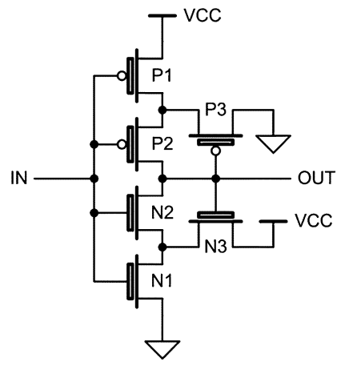
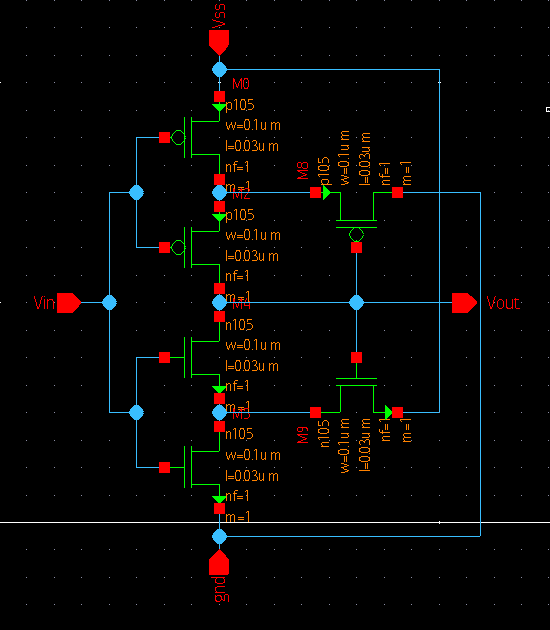
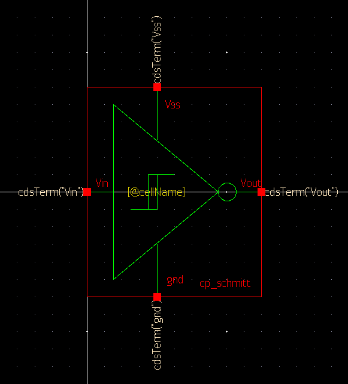
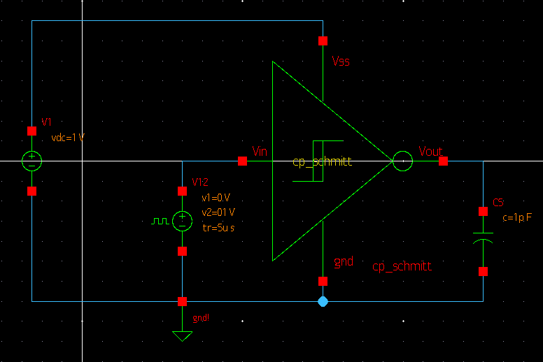
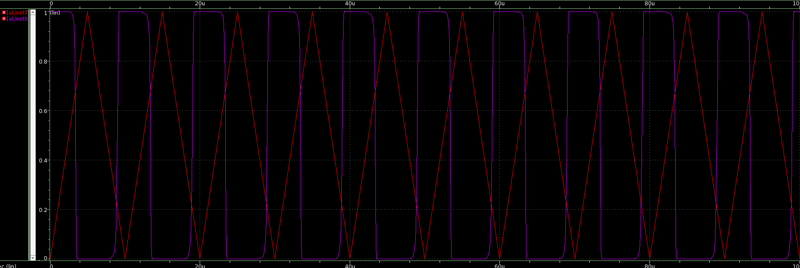
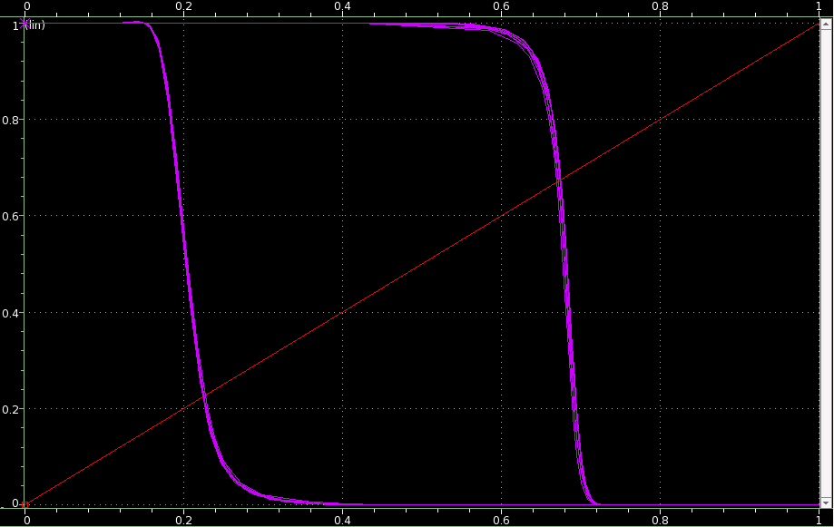

# CMOS_Schmitt
Analog design and simulation of a CMOS Schmitt trigger using synopsys custom design compiler for the analog design hackathon by IITH and VSD

---

## List of contents

- Abstract
- Introduction
- Tools used
- Circuit design
- Implementation
- Netlist
- Results
- Conclusion
- Acknowledgements

---

## Abstract

A Schmitt trigger is used for converting analog value to a binary value, but reducing noise compared to a simple comparator. Here, a schmitt trigger is implemented and simulated using 28nm CMOS process and synopsys custom compiler.

The initial proposal submitted for the hackathon can be viewed at [docs/proposal.pdf](docs/proposal.pdf)

## Introduction

A Schmitt trigger is used for converting analog value to a binary value, but reducing noise compared to a simple comparator. 

It does this by having two different threshold points that depend on the current output value, for thresholding the input. These thresholds are called lower threshold and upper threshold. In a conventional comparator, if an input signal with low slew rate is given, noise can easily cause momentary switching in the output. This is because when the input is near threshold, even a small noise signal can cause overall input to cross the threshold. 

However, in a schmitt trigger, if the ouput signal flips from low to high or wise versa, the threshold also changes. So, a much higher noise signal amplitude is need to cause fluctuations.


Here, an inverting CMOS Schmitt trigger is implemented using 28nm process and simulated using synopsys custom compiler tool

## Tools used

- **Synopsys Custom Compiler**
  - A tool for full-custom analog, custom digital and mixed signal IC design
  - Used for design entry as schematic, simulation management and analysis

- **Synopsys Primewave**
  - An environment for simulation setup and analysis for the synopsys custom design platform
  - Used for simulation of the circuit

- **Synopsys 28nm PDK**
  - Used for importing the spice models of the CMOS devices (nMOS, pMOS) for designing and simulating the circuit

---

## Circuit design

The design of the inverting CMOS schmitt trigger is as follows :



When the output is high, N3 turns ON. To turn the output low, the pulldown circuit has to activate. For this, both N2 and N1 must turn ON. N1 can turn on when Vin > Vth, but Vin must be higher for N2 to turn on since its source is connected to a non-ground voltage through the combination of N3 and N1. When the input becomes greater than this threshold, the output switches low

When the output is low, P3 turns ON and to turn output high again, P2 and P1 needs to turn ON. P1 can turn on for Vin < (Vcc - Vth) but P2 can turn on only at lower voltages because its source is not at Vcc but at a lower voltage decided by the combination of P1 and P3.

Like this, the lower threshold voltage is determined by the PMOS pullup logic and the upper threshold is determined by the NMOS pulldown logic. The design equations for this are :


Here, k denodes the transconductance parameters of the transistors


This means


We decide to use this ratio to be 1 in our design. L, or length of the MOSFET gates are 28nm in our process. The widths are all kept as default.

---

## Implementation

In the synopsys custom compiler, first we create a library and a schematic for the schmitt trigger component. We add the nMOS and pMOS devices from the PDK library, connect them and add input and output pins



Then, a symbol was designed for the inverting schmitt trigger



For verifying the component works, a tesbench was created, which was designed in schematic view. Components from the standard synopsys ```analogLib``` library was used for this.

A 1V DC source is used for powering the device and a pulse source with a very high rise and fall time and zero on time is used for generating a rectangular pulse. A capacitor is used as the load



---
## Netlist

#### Schmitt trigger component

```
*Custom Compiler Version S-2021.09
*Tue Mar  1 15:54:44 2022

*.SCALE METER
*.LDD
.GLOBAL gnd! vdd!
********************************************************************************
* Library          : cp_lib1
* Cell             : cp_schmitt
* View             : schematic
* View Search List : auCdl schematic
* View Stop List   : auCdl
********************************************************************************
.subckt cp_schmitt Vin Vout Vss gnd gnd! vdd!
*.PININFO Vin:I Vout:O Vss:I gnd:I gnd!:B vdd!:B
MM8 gnd Vout net7 vdd! p105 w=0.1u l=0.03u nf=1 m=1
MM2 Vout Vin net7 vdd! p105 w=0.1u l=0.03u nf=1 m=1
MM0 net7 Vin Vss vdd! p105 w=0.1u l=0.03u nf=1 m=1
MM9 net15 Vout Vss gnd! n105 w=0.1u l=0.03u nf=1 m=1
MM5 net15 Vin gnd gnd! n105 w=0.1u l=0.03u nf=1 m=1
MM4 Vout Vin net15 gnd! n105 w=0.1u l=0.03u nf=1 m=1
.ends cp_schmitt
```

#### Testbench

```
*Custom Compiler Version S-2021.09
*Tue Mar  1 15:54:44 2022

*.SCALE METER
*.LDD
.GLOBAL gnd! vdd!
********************************************************************************
* Library          : cp_lib1
* Cell             : cp_schmitt
* View             : schematic
* View Search List : auCdl schematic
* View Stop List   : auCdl
********************************************************************************
.subckt cp_schmitt Vin Vout Vss gnd gnd! vdd!
*.PININFO Vin:I Vout:O Vss:I gnd:I gnd!:B vdd!:B
MM8 gnd Vout net7 vdd! p105 w=0.1u l=0.03u nf=1 m=1
MM2 Vout Vin net7 vdd! p105 w=0.1u l=0.03u nf=1 m=1
MM0 net7 Vin Vss vdd! p105 w=0.1u l=0.03u nf=1 m=1
MM9 net15 Vout Vss gnd! n105 w=0.1u l=0.03u nf=1 m=1
MM5 net15 Vin gnd gnd! n105 w=0.1u l=0.03u nf=1 m=1
MM4 Vout Vin net15 gnd! n105 w=0.1u l=0.03u nf=1 m=1
.ends cp_schmitt  
```

---

## Results

When simulated, the waveform came up as expected, and as follows



Hysteris effect of the schmitt trigger can be seen by chaning the x axis used for plotting to the input. The result was



---

## Conclusion

- An inverting schmitt trigger was designed and tested for the 28nm PDK using the synopsys custom compiler toolchain

---

## Acknowledgement

- VLSI System Design (VSD) Corporation Private Limited India
- Indian Institute of Technology, Hyderabad (IITH)
- Synopsys India
- Team at "cloud based analog design hacakthon 2022, IITH"

---
